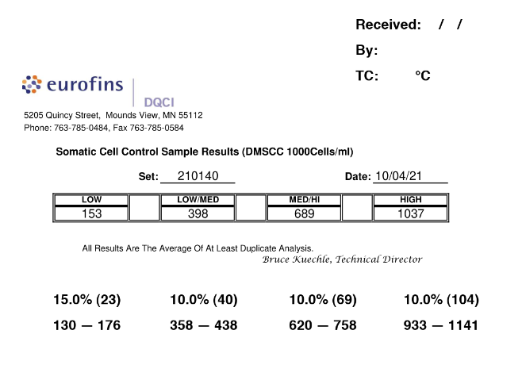

# eSCCStandardsReport

---

Gets eSCC standards report from Eurofins website and auto-calculates the allowed ranges described in the [NCIMS 2400s](http://ncims.org/wp-content/uploads/2018/05/2400a-10-Foss-BacSomatic-Rev-04-18.pdf#page=7).

### **Options:**

---
* [Report (rpt)](https://rmpg3zf4oa.execute-api.us-west-1.amazonaws.com/default/sccrpt_docker?option=rpt)
    * **Default**
    * Newest Eurofins SCC control data as annotated report.
        * Includes valid SCC ranges and section for receiving information.
* [Original PDF (opdf)](https://rmpg3zf4oa.execute-api.us-west-1.amazonaws.com/default/sccrpt_docker?option=opdf)
    * Newest Eurofins SCC control data in pdf format.
* [Original Text (otxt)](https://rmpg3zf4oa.execute-api.us-west-1.amazonaws.com/default/sccrpt_docker?option=otxt)
    * Newest Eurofins SCC control data in text format.

### **AWS Lambda URL:**

---
>**https://rmpg3zf4oa.execute-api.us-west-1.amazonaws.com/default/sccrpt_docker**

To generate other options, add ***?option=( rpt / opdf / otxt )*** to end of url.

### **Workflow**

---
1. Makes GET request to pull pdf report of most recent milk SCC calibration standards data from [Eurofins website]("https://www.eurofinsus.com/food-testing/services/testing-services/dairy/calibration-standards-results/").
    * `sccrpt.get_content`
2. Converts file from pdf to png.
    * `sccrpt.recent_img_report`
3. Extracts text data from pdf and performs calculations under NCIMS 2400s guidelines.
    * `sccrpt.gen_scc_ranges`
4. Writes calculated values on image and saves as new image.
    * `sccrpt.report`

### **TO-DO:**

---
* [ ] *Domain Name*
    * Custom domain name for easier access/memorization.
* [ ] *Optimization*
    * A lot of repeated work done so re-do some functions in `sccrpt.report`.
